# BSC Textiles Portal — Enterprise HRMS & Multi-Location Store Platform

A comprehensive, multi-location Enterprise Portal for BSC Textiles (Belagavi · Davanagere · Shivamogga)
covering hiring, human resources, store operations, security and developer diagnostics — with **one
synchronized user/employee data flow** so every dashboard shows the same account information.

> **Read this first if you work on accounts, employees, roles, permissions or locations**
> → [§3 User & Employee Account Synchronization](#3-user--employee-account-synchronization-single-source-of-truth)
> and [§4 Account Lifecycle Flows](#4-account-lifecycle-flows).

---

## Table of Contents

1. [Overview](#1-overview)
2. [System Architecture](#2-system-architecture)
3. [User & Employee Account Synchronization (single source of truth)](#3-user--employee-account-synchronization-single-source-of-truth)
4. [Account Lifecycle Flows](#4-account-lifecycle-flows)
5. [Dashboard Sync Matrix](#5-dashboard-sync-matrix)
6. [Locations, Roles & Permissions (RBAC)](#6-locations-roles--permissions-rbac)
7. [API Reference — Accounts & Employees](#7-api-reference--accounts--employees)
8. [Search, Filters, Sorting & Pagination](#8-search-filters-sorting--pagination)
9. [Data Refresh, Caching & Stale-Data Prevention](#9-data-refresh-caching--stale-data-prevention)
10. [Verification & Test Coverage](#10-verification--test-coverage)
11. [Project Layout](#11-project-layout)
12. [Setup & Running](#12-setup--running)
13. [Deployment](#13-deployment)

---

## 1. Overview

| | |
|---|---|
| **Frontend** | React 18 + TypeScript, Vite, Tailwind CSS 3, React Router v6, Lucide icons, Recharts |
| **Backend** | Node.js ≥ 18, Express 4, JWT auth, bcryptjs, Socket.IO, Multer, Helmet, rate limiting |
| **Database** | MySQL 8 (self-healing auto-initializer, connection pool, `dateStrings: true`) |
| **Realtime** | Socket.IO events for live dashboards |
| **Ports (dev)** | Backend `5000`, frontend Vite dev server `3000` (proxies `/api` + `/uploads` → 5000) |

The portal serves four store personas — **Super Admin / Admin**, **HR**, **Manager**, **Greeter** plus
self-service **Employee** accounts — and every one of them is backed by exactly one database record.

### What "synchronized accounts" means here

* An account created in **User Management** appears immediately in the **Employee Directory**,
  location dashboards, department/designation sections and Wedding CRM assignment lists.
* An employee marked **Joined** on the **Offer Desk** automatically gets a login account, an
  Employee ID and role-based module access.
* Editing a name / email / phone / department / designation in **either** module updates **both**.
* Deactivating an account blocks its live sessions within seconds, on the backend — not just in the UI.
* Deleting an employee removes the recruitment record **and** its derived account, and releases every
  cross-module reference, so no ghost row can appear anywhere.

---

## 2. System Architecture

```mermaid
flowchart TD
    subgraph CLIENT["Frontend — React 18 SPA (Vite, port 3000)"]
        UI["Pages<br/>Dashboard · Candidates · Offer Desk<br/>Employees · User Management · Settings<br/>Wedding CRM · Attendance · MCheck"]
        SB["Sidebar / Topbar<br/>nav filtered by permissions"]
        API["services/api.ts<br/>apiFetch() + Bearer token"]
    end

    subgraph SERVER["Backend — Express (backend/index.js)"]
        MW["middleware/auth.js<br/>authenticate · authorize · authorizeModule<br/>getLocationFilter · injectLocationId"]
        RT["routes/api.js"]
        CT["controllers/<br/>userManagement · candidate · offer · settings<br/>location · security · wedding · interview"]
        SVC["services/<br/>userSyncService (sync core)<br/>candidateService · authorizationService · auditService"]
        VAL["validators/<br/>userValidator · candidateValidator · authValidator"]
    end

    subgraph DB[("MySQL 8 — hrms_db")]
        T1[("users  ← master account")]
        T2[("candidates  ← recruitment record")]
        T3[("user_locations")]
        T4[("user_permissions")]
        T5[("locations")]
        T6[("selection_offers")]
        T7[("audit_logs")]
    end

    UI --> SB --> API
    API -->|"HTTPS /api/*"| MW --> RT --> CT
    CT --> VAL
    CT --> SVC --> DB
    SVC -->|"2-way field sync"| T1
    SVC --> T2
```

**Request pipeline**

```
Client (Bearer JWT)
  → authenticate()        verifies signature, expiry, account exists, active, not locked
  → authorize(role…)      role gate (Admin / Super Admin / HR / Manager …)
  → authorizeModule()     per-module permission check against user_permissions
  → validate()            server-side input validation
  → controller            business logic
  → service               persistence + cross-table synchronization
  → audit_logs            every sensitive action recorded
  → successRes/errorRes   standardized JSON envelope
```

---

## 3. User & Employee Account Synchronization (single source of truth)

### 3.1 The two records that describe one person

There is **no separate copy** of an account anywhere in the system. Two database rows describe one
person, and they are joined by a unique key:

| Table | Role | Key fields |
|---|---|---|
| **`users`** | **Master account** — login identity, role, location(s), status, permissions | `id`, `username`, `employee_id` (unique), `candidate_app_no` (unique) |
| **`candidates`** | Recruitment/HR record — pipeline, documents, salary, DOJ | `app_no` (unique), `status` |

```
users.candidate_app_no  ──(unique FK, 1:1)──▶  candidates.app_no
```

* Every account **can** be linked to a candidate (auto-provisioned ones always are; admin-created
  accounts may be linked by passing `candidateAppNo`).
* The link is **unique in both directions** (`idx_users_cand_app`, `idx_users_emp_id`), so a candidate
  can never own two accounts and an account can never point at two candidates. **No duplicates.**

### 3.2 Entity relationships

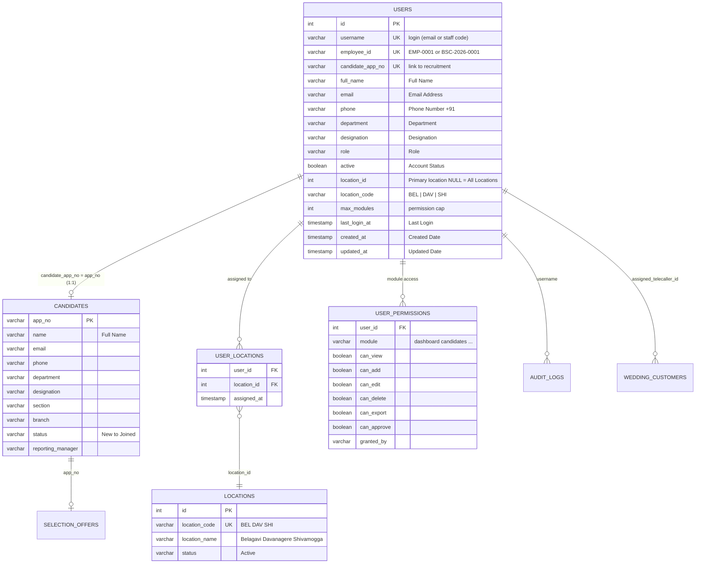

### 3.3 Shared fields — who owns what, and how they stay identical

| Field | Master column | Mirrored column | Sync direction |
|---|---|---|---|
| Full Name | `users.full_name` | `candidates.name` | both ways |
| Email Address | `users.email` | `candidates.email` | both ways |
| Phone Number | `users.phone` | `candidates.phone` | both ways |
| Department | `users.department` | `candidates.department` | both ways |
| Designation | `users.designation` | `candidates.designation` | both ways |
| Assigned Location(s) | `users.location_id` + `user_locations` | `candidates.location_id` (origin) | users → dashboards |
| Role | `users.role` | `selection_offers` (recruitment view) | users → views |
| Account Status | `users.active` | — | users → everything |
| Employee ID | `users.employee_id` | `candidates.app_no` (for provisioned staff) | users → everything |
| Created / Updated Date | `users.created_at` / `updated_at` | `candidates.created_at` / `updated_at` | independent |
| Last Login | `users.last_login_at` | — | users only |

Two helpers in **`backend/src/services/userSyncService.js`** keep the shared fields identical:

| Helper | Direction | Called by |
|---|---|---|
| `syncUserFromCandidate(appNo)` | candidate → users | candidate/employee profile edits, bulk import, provisioning, boot backfill |
| `syncCandidateFromUser(userId)` | users → candidate | User Management edits, Employee Directory account edits |

Both use `COALESCE(NULLIF(TRIM(x), ''))` so a sparse edit can never wipe out a value owned by the
other side, and both are idempotent — running them repeatedly is always safe.

```
┌────────────────────────┐         shared fields         ┌────────────────────────┐
│        users           │ ◀──── syncUserFromCandidate ──│       candidates       │
│   (master account)     │    syncCandidateFromUser ───▶ │  (recruitment record)  │
└───────────┬────────────┘                               └───────────┬────────────┘
            │  every dashboard below is a VIEW over these two tables │
            ▼                                                        ▼
   User Management · Employee Directory · Offer Desk · Candidate CRM
   Location dashboards · Department sections · Designation sections
   Attendance · Section Allocation · Global search · Wedding CRM
```

### 3.4 Every write path funnels through the same sync core

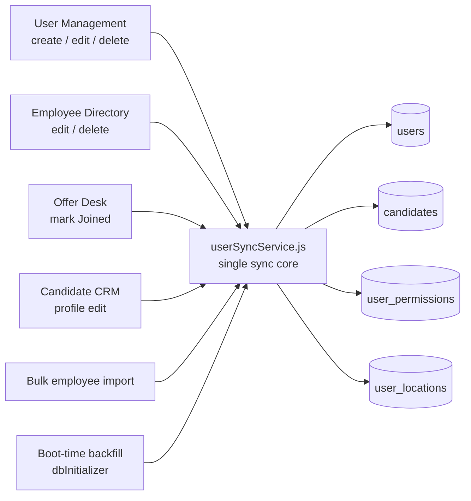

That is why the legacy `/settings/users` endpoints **delegate** to `userManagementController`, and why
the Offer Desk, bulk import and boot backfill all call `provisionUserForCandidate()` — one
implementation, one behaviour, no divergence.

### 3.5 Employee ID rules

| Situation | Employee ID |
|---|---|
| Admin types one at create/edit | used as-is (uniqueness enforced, 409 on clash) |
| Account linked to a candidate | candidate application number, e.g. `BSC-2026-0001` |
| Admin-created account with no ID supplied | auto-generated `EMP-0001`, `EMP-0002`, … |
| Account created without an ID (older rows) | backfilled automatically on the next save/boot |

It is shown identically in User Management, the Employee Directory, the profile drawer and exports.

---

## 4. Account Lifecycle Flows

### 4.1 Create User

**UI:** User Management → *Create User* · **API:** `POST /api/admin/users`

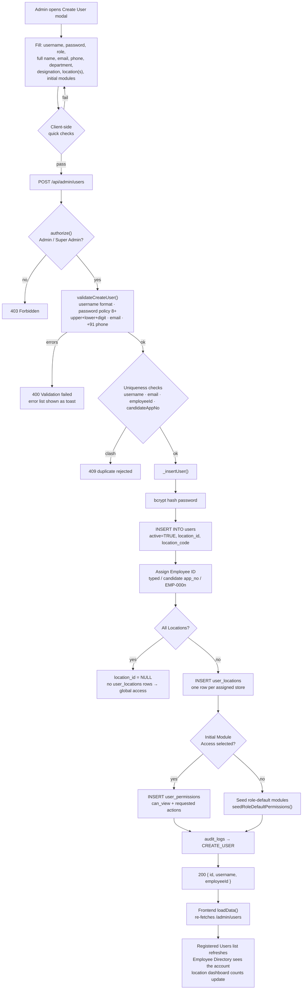

**Create → Validate → Save → Assign Role → Assign Location → Assign Permissions →
Update related records → Refresh dashboards** — exactly that order, nothing skipped.

### 4.2 Edit User

**UI:** User Management → row *Edit* · **API:** `PUT /api/admin/users/:id`

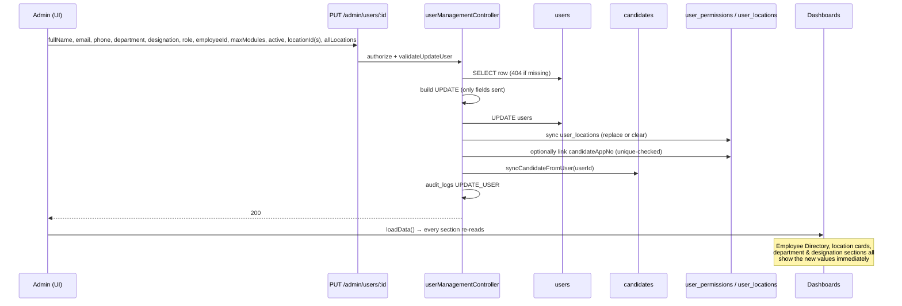

Role change → permissions stay, navigation re-evaluates on the next `GET /my-permissions`.
Location change → primary location + `user_locations` are written **together** (see §4.3).

### 4.3 Change Location (multi-location aware)

**UI:** User Management → inline location dropdown on each row, or the Edit modal.

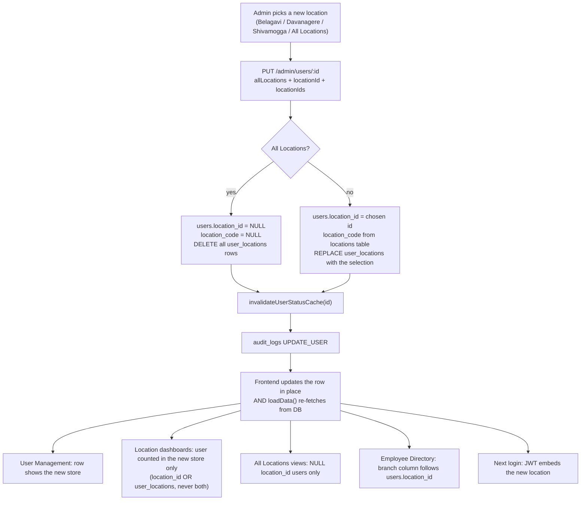

> **Why this is safe:** earlier, sending only `locationIds` updated `user_locations` but left the stale
> store inside `users.location_id`, so login and the location dashboards disagreed. The primary
> location column is now always derived from the same request (`locationId` → first `locationIds`
> entry → `NULL`), so both stores of truth can never diverge again.

### 4.4 Change Department / Designation

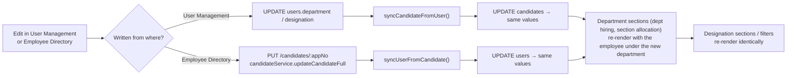

### 4.5 Deactivate / Reactivate

**UI:** User Management → shield toggle · **API:** `POST /api/admin/users/:id/toggle-status`

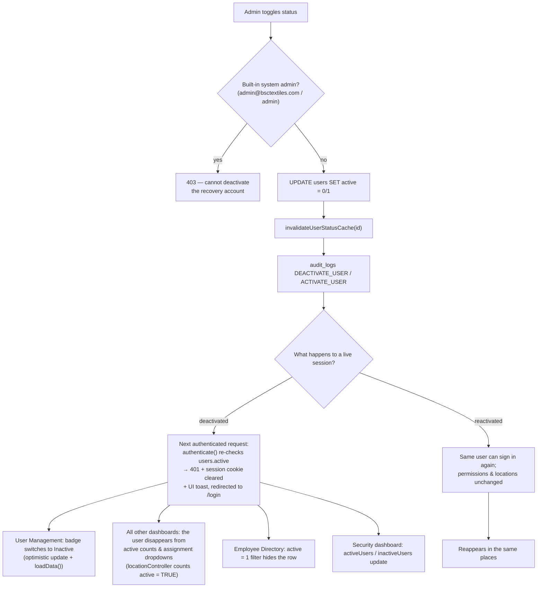

> Deactivation is **enforced on the backend**, not hidden in the UI. Even with a still-valid JWT the
> request is refused within the 5-second status-cache window.

### 4.6 Delete

**UI:** User Management → trash (confirm) · **API:** `DELETE /api/admin/users/:id`

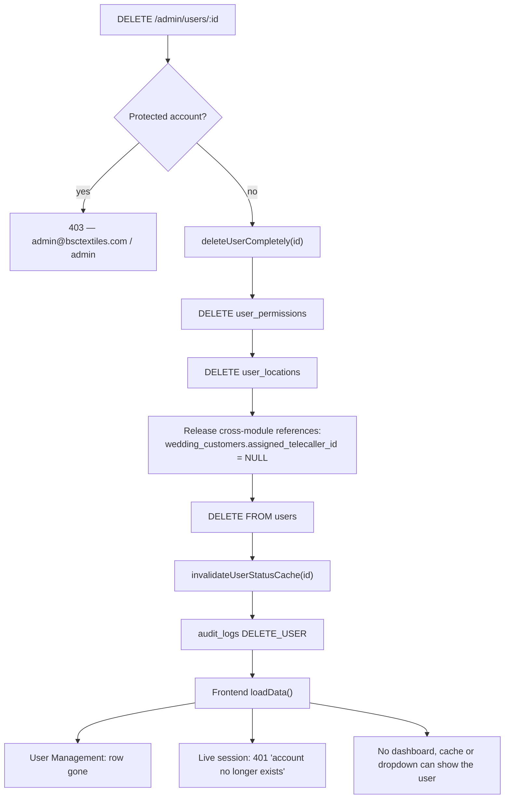

**Deleting an Employee from the Employee Directory** (`DELETE /api/employees/:id`) removes the
recruitment record (offers, interviews, activities — in a transaction), **and** the derived login
account, in the same request. The directory and User Management cannot disagree afterwards.

### 4.7 Change Permissions (Initial Module Access → Permissions Matrix)

**UI:** User Management → shield icon per row · **API:** `GET/PUT /api/admin/users/:id/permissions`

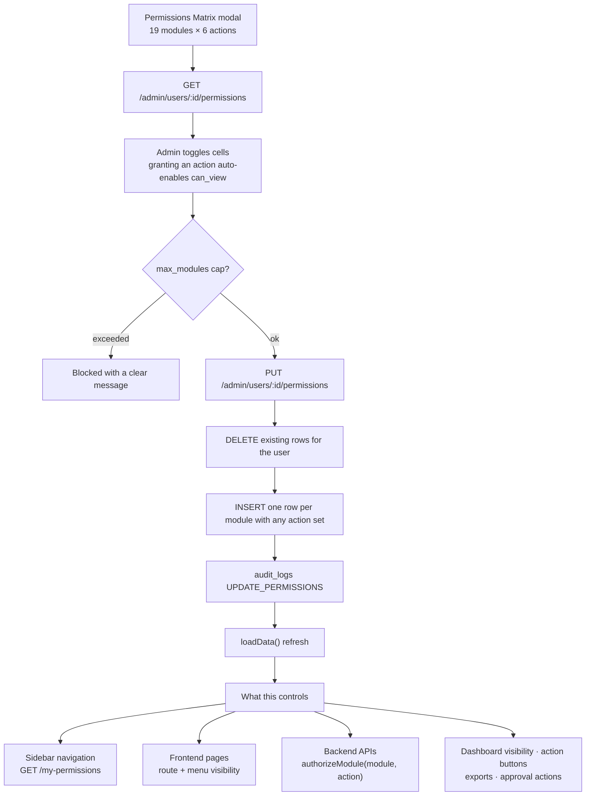

**Not frontend-only:** every protected API route re-checks the module permission server-side, so a
tampered UI still gets `403`.

Role-change interplay: `Admin` / `Super Admin` bypass module checks; every other role is judged by
these rows. New accounts with no modules chosen inherit their role's default visibility (mirroring
the sidebar's `roleNavMap`), so navigation and the matrix agree from the first login.

### 4.8 Offer Desk → Employee (auto-provisioning)

**UI:** Offer Desk → *Mark Joined* / *Accept Offer* · **API:** `POST /api/offers/mark-joined`

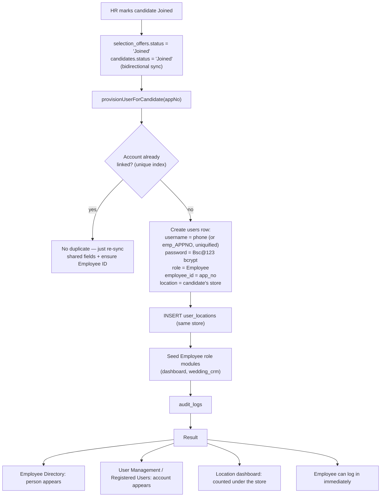

The same provisioning runs for **bulk Excel import** and in a **boot-time backfill** that repairs any
legacy joined candidate missing an account — so historical data converges instead of drifting.

### 4.9 Login & Access Enforcement

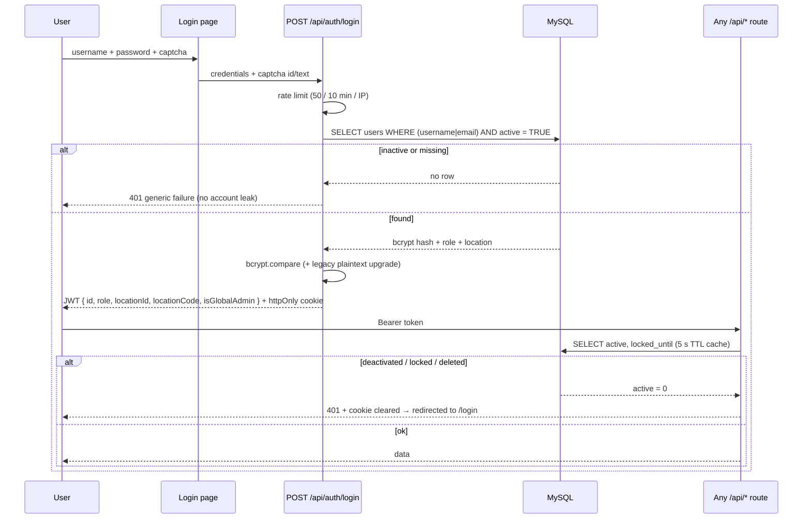

Location isolation on every data query: `getLocationFilter(req)` builds
`AND location_id IN (…)` from `user_locations` (falling back to the single `location_id`),
and `location_id = NULL` means **All Locations** — global admins see every store.

---

## 5. Dashboard Sync Matrix

| Dashboard / Section | Reads | Updates automatically when |
|---|---|---|
| **User Management — Registered User Accounts** | `users` + `user_locations` + `user_permissions` (counts) | create / edit / role / location / status / delete → `loadData()` |
| **Employee Directory** (`/employees`) | `users JOIN candidates JOIN selection_offers JOIN locations` (`active = 1`) | profile edit, status change, department/designation change, provisioning, delete |
| **Role & Permissions** | `users.role` + `user_permissions` + `page_visibility` | permission save, role change, role defaults seeded at create |
| **Location dashboards** (`/locations` stats, System Admin) | `users` (active) + `user_locations` + `candidates` | create, location change, deactivate, delete |
| **Department sections** (Dept Hiring, Section Allocation, filters) | `users.department` / `candidates.department` | department edit from either module |
| **Designation sections** (Openings, Employees filters) | `users.designation` / `candidates.designation` | designation edit from either module |
| **Attendance & Roster** | `GET /employees` | any employee/account change |
| **Dashboard KPIs** (joined staff, active employees) | `GET /employees` + `candidates` | provisioning, join, deactivation |
| **Global search** | `GET /employees` + `GET /candidates` | any change above |
| **Wedding CRM telecaller picker** | `GET /wedding-crm/telecallers` (active users) | create, deactivate, delete (+ reference cleanup) |
| **System Admin / Security** | `users` counts, `audit_logs`, login activity | status change, logins, password resets |
| **Settings → User Accounts** | `GET /settings/users` (same `users` table) | every account change |

**No dashboard keeps its own copy** of an account; each one simply queries the source of truth, and
each mutating flow ends with an explicit refresh (§9).

---

## 6. Locations, Roles & Permissions (RBAC)

### 6.1 Four-layer authorization chain

```
1. Authentication   → valid, unexpired JWT
2. Account state    → exists · active = TRUE · not locked        (backend-enforced)
3. Role             → Admin / Super Admin bypass module checks
4. Location (LBAC)  → location_id = NULL  → All Locations
                      location_id = n     → that store
                      user_locations rows → every assigned store
5. Module + action  → user_permissions.can_view / can_add / can_edit /
                      can_delete / can_export / can_approve
6. Resource level   → per-row location check via authorizeLocationAccess()
```

`backend/src/services/authorizationService.js` is the single evaluation point, exposed as the
`authorizeAction(module, action)` and `authorizeLocationAccess(param)` middleware factories.

### 6.2 Locations

| id | code | name | meaning |
|---|---|---|---|
| 1 | BEL | Belagavi | store 1 |
| 2 | DAV | Davanagere | store 2 (default for new store users) |
| 3 | SHI | Shivamogga | store 3 |
| — | — | All Locations | `location_id IS NULL` → global access |

* The list is **never hard-coded** in the UI — every dropdown is filled from `GET /api/locations`
  (which the auto-initializer seeds idempotently).
* Multi-location staff get one row per store in `user_locations`; dashboards count a user under a
  store when it is their **primary** location **or** an assigned one — never double-counted.
* Changing a store's location updates the primary column and the junction table in the same request.

### 6.3 Roles & default module access

| Role | Seeded module visibility (can_view) |
|---|---|
| Super Admin / Admin | all modules (bypass checks) |
| HR / Manager | dashboard, wedding_crm, footfall, feedback ×4, divert, candidates, offer, openings, employees, dept_hiring, section_allocation, broadcast, mcheck ×3 |
| Recruiter | dashboard, wedding_crm, candidates, broadcast |
| Interviewer | candidates |
| Employee | dashboard, wedding_crm |
| Greeter | wedding_crm, footfall, feedback_collection, feedback_list, feedback_qr, divert |
| Guest | (none) |

`ROLE_DEFAULT_MODULES` in `userSyncService.js` mirrors `roleNavMap` in `Sidebar.tsx`, so what a person
sees in navigation, what the permissions matrix shows, and what the backend allows are the same list.

---

## 7. API Reference — Accounts & Employees

All endpoints return the standard envelope `{ success, message, data }` (or `{ success:false, errors }`).

### Authentication
| Method | Path | Notes |
|---|---|---|
| POST | `/api/auth/verify` | login (captcha required, rate-limited) |
| POST | `/api/auth/logout` | records sign-out in `audit_logs` |
| GET | `/api/my-permissions` | current user's module list (`custom: true` when per-user rows exist) |

### Registered User Accounts (Admin)
| Method | Path | Purpose |
|---|---|---|
| GET | `/api/admin/users` | list with role, location(s), department, designation, Employee ID, status, module count, last login |
| GET | `/api/admin/users/:id` | full profile + permissions + recent activity |
| POST | `/api/admin/users` | create (validated, uniqueness-checked, permissions seeded) |
| PUT | `/api/admin/users/:id` | update any subset of fields |
| DELETE | `/api/admin/users/:id` | delete with full reference cleanup |
| GET / PUT | `/api/admin/users/:id/permissions` | permissions matrix |
| POST | `/api/admin/users/:id/toggle-status` | activate / deactivate |
| POST | `/api/admin/users/:id/reset-password` | password policy enforced |
| GET | `/api/admin/users/modules` | module registry for the matrix |

### Employees (HR / Manager / Admin)
| Method | Path | Purpose |
|---|---|---|
| GET | `/api/employees` | Employee Directory — location-scoped, active accounts joined with their HR record |
| PUT | `/api/employees/:id` | update employee + linked account in one save (accepts user id, username or app_no) |
| DELETE | `/api/employees/:id` | delete employee **and** derived account |
| POST | `/api/employees/bulk` | Excel/CSV bulk import, each row also provisioned |

### Legacy Settings endpoints (delegate to the same logic)
| Method | Path | Behaviour now |
|---|---|---|
| GET | `/api/settings/users` | live `users` table — no hard-coded defaults |
| POST | `/api/settings/users/add` | delegates to `createUser` (same validation) |
| POST | `/api/settings/users/update` | resolves id/username → delegates to `updateUser` |
| POST / DELETE | `/api/settings/users/delete` · `DELETE /api/settings/users/:id` | delegates to `deleteUser` |

### Locations
| Method | Path | Notes |
|---|---|---|
| GET | `/api/locations` | active stores + per-store user/candidate counts |
| GET | `/api/locations/stats` | global admin dashboard roll-up |
| POST / PUT | `/api/locations`, `/api/locations/:id` | create / update stores (global admin) |

---

## 8. Search, Filters, Sorting & Pagination

Synchronized records behave identically in every list:

| Concern | User Management | Employee Directory |
|---|---|---|
| Search | username, full name, email, department, designation, role | name, app no, phone, section |
| Location filter | Belagavi / Davanagere / Shivamogga / All Locations (GLOBAL) / per store id | server-side via `getLocationFilter` (store users see only their stores) |
| Role filter | all roles from the registry | — |
| Department filter | — | `getUniqueDepartments()` (never hard-coded) |
| Designation filter | — | unique designations from live rows |
| Status filter | Active / Inactive / All | active accounts only (inactive hidden) |
| Section filter | — | allocations + department sections |
| Sorting | by creation order | name A-Z, newest DOJ, salary |
| Range filter | — | today / yesterday / week / month / custom |
| Pagination | server returns all, client table scrolls | `page`/`limit` supported server-side |

Search text is matched case-insensitively against **live data** — a renamed employee is immediately
findable by the new name and no longer by the old one.

---

## 9. Data Refresh, Caching & Stale-Data Prevention

### 9.1 Frontend refresh contract

| Action | After success |
|---|---|
| Create user | `loadData()` → `GET /admin/users` |
| Edit user (incl. role/location) | `loadData()` |
| Inline location change | optimistic row update **+** `updateAdminUser` persists; next `loadData()` reconciles |
| Toggle status | optimistic badge update; `active` comes from the server response |
| Delete user | `loadData()` |
| Save permissions | `loadData()` |
| Reset password | modal closes; no stale password state exists |
| Employee Directory edit | `loadEmployees()` re-fetches and re-merges section allocations |
| Employee delete | `loadEmployees()` |

### 9.2 Full page refresh

Every page loads its data on mount (`useEffect` → API) — nothing is cached in `localStorage` except
the *session* (JWT + location). A hard reload therefore always shows the database state.

### 9.3 Backend cache policy

| Cache | TTL | Invalidated by |
|---|---|---|
| Account status (`active` / `locked`) used by `authenticate` | 5 s | toggle-status, update(active), delete, plus natural expiry |
| Permissions | none (read live) | — |
| Locations / modules | none (read live) | — |

> On a database outage the status check **fails open** (same policy as the rest of the platform) so
> kiosks, TVs and the health endpoint keep working; the check resumes as soon as MySQL is reachable.

---

## 10. Verification & Test Coverage

```bash
node --test "tests/**/*.test.js"     # unit + whitebox + blackbox
```

| Suite | Focus |
|---|---|
| `tests/unit/validation.test.js` | user validator: password policy, email, +91 phone, username, roles |
| `tests/unit/authorization.test.js` | permission chain, location checks, role bypass |
| `tests/unit/loginSecurity.test.js` | attempt budgeting / lockout |
| `tests/unit/{captcha,crypto,csv,response}.test.js` | supporting utilities |
| `tests/whitebox/auth.test.js` | token issuing, plaintext upgrade, logout |
| `tests/blackbox/http.test.js` | full HTTP surface: health, SPA, gzip, caching, login success/failure, master recovery without DB, token guards, 404 envelope, shield endpoints, rate limiting |

### Manual verification checklist (per account change)

```
Create user        → appears in Registered Users + Employee Directory + location card
Edit user          → all fields identical in both modules after reload
Change role        → permissions + navigation follow
Change location    → old store loses them, new store gains them, All Locations stays correct
Change department  → department sections update in both directions
Change designation → designation sections/filters update
Change permissions → nav, pages, APIs, buttons, exports all follow
Deactivate         → badge flips, live session dies <=5 s, removed from active counts
Reactivate         → returns everywhere, permissions intact
Delete             → gone everywhere, wedding references released
Bulk import        → each imported row gets an account + Employee ID
Search / filter    → finds the new values, not the old ones
Login              → blocked while inactive, allowed when reactivated
Mobile / desktop   → tables collapse to cards; same data
Full page refresh  → identical values (no stale cache)
```

---

## 11. Project Layout

```
BSC_SMG/
├── index.js                  → boots backend/index.js (Passenger entry)
├── backend/
│   ├── index.js              → Express app, static SPA, Socket.IO, uploads
│   └── src/
│       ├── config/
│       │   ├── db.js                 → MySQL pool
│       │   └── dbInitializer.js      → self-healing schema + seed + backfill
│       ├── controllers/
│       │   ├── userManagementController.js  → accounts, permissions, status
│       │   ├── candidateController.js       → candidates + Employee Directory
│       │   ├── offerController.js           → offers + join provisioning
│       │   ├── settingsController.js        → settings (users delegated)
│       │   └── location|security|wedding|interview|...
│       ├── middleware/auth.js        → authenticate/authorize/authorizeModule
│       ├── routes/api.js             → all endpoints
│       ├── services/
│       │   ├── userSyncService.js    → SYNCHRONIZATION CORE (single source)
│       │   ├── candidateService.js   → candidate CRUD + directory query
│       │   └── authorizationService.js
│       ├── utils/  validators/  scripts/
├── frontend/
│   └── src/
│       ├── pages/UserManagement.tsx  → Registered User Accounts
│       ├── pages/Employees.tsx       → Employee Directory
│       ├── pages/Settings.tsx        → settings (accounts reference card)
│       ├── components/Sidebar.tsx    → permission-filtered navigation
│       └── services/api.ts           → typed API client
├── database/                 → base schema + migration SQL
├── docs/  memory/  tests/  uploads/
└── README.md
```

---

## 12. Setup & Running

```bash
# 1. install
npm install                 # root (also builds backend)
cd frontend && npm install  # frontend deps

# 2. configure
cp .env.example .env        # DB_HOST/DB_PORT/DB_NAME/DB_USER/DB_PASSWORD, JWT_SECRET

# 3. run (dev)
npm run dev                 # backend :5000  +  frontend :3000 (proxies /api)

# 4. optional seed of demo accounts
npm run seed

# 5. tests
npm test
```

Environment variables (backend): `PORT`, `NODE_ENV`, `JWT_SECRET`, `JWT_REFRESH_SECRET`,
`DB_HOST`, `DB_PORT`, `DB_NAME`, `DB_USER`, `DB_PASSWORD`, `UPLOAD_DIR`, `SESSION_HOURS`,
`COOKIE_SECURE`, `ENCRYPTION_KEY` — see `.env.example`.

On first boot the auto-initializer creates every missing table, seeds the three locations, the built-in
accounts and the page-visibility defaults, adds performance indexes, and backfills missing employee
accounts — **without ever deleting or overwriting valid existing data**.

### Built-in accounts

| Username | Password | Role | Notes |
|---|---|---|---|
| `admin@bsctextiles.com` | `admin@2026` | Admin | documented master recovery credential (force-reset on boot) |
| `hr@bsctextiles.com` / `hr` | seeded hash | HR | |
| `manager@bsctextiles.com` / `manager` | seeded hash | Manager | |
| `greeter@bsctextiles.com` / `greeter` | `bsc@123` | Greeter | |

Passwords are bcrypt-hashed and never displayed anywhere in the UI.

---

## 13. Deployment

* Hostinger Passenger: startup file `backend/index.js` (`PassengerAppType=node`).
* Passenger injects `PORT` — the app always listens on it; never hard-code a port.
* `NODE_ENV=production` in the panel; set a strong `JWT_SECRET` and `ENCRYPTION_KEY`.
* Uploads must point at a persistent path via `UPLOAD_DIR`.
* All schema changes are applied idempotently at boot; no manual migration step is required.

Further reading: `memory/architecture.md`, `memory/permissions.md`, `memory/security.md`, `DOCME.md`,
and `backend/README.md` (security architecture in depth).

> Full backend security details: see `backend/README.md`.
